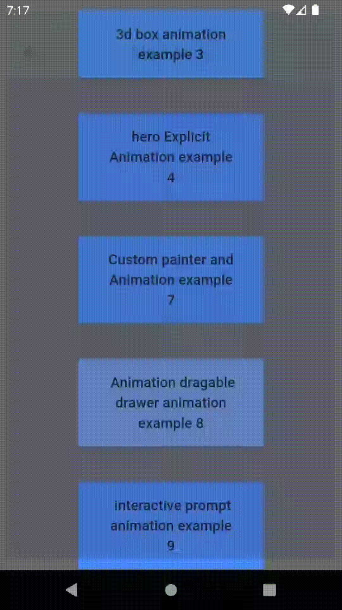
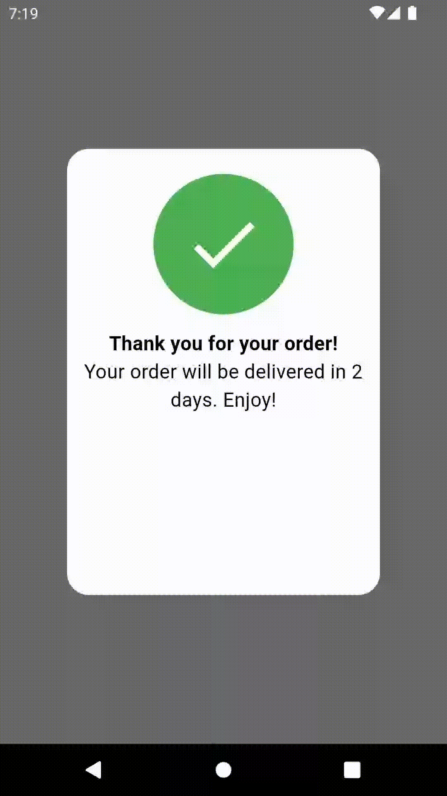
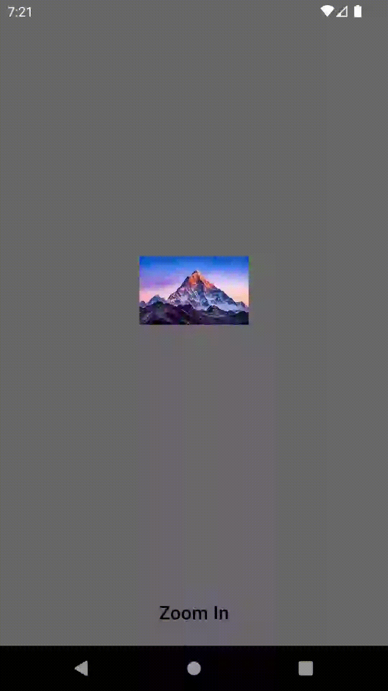
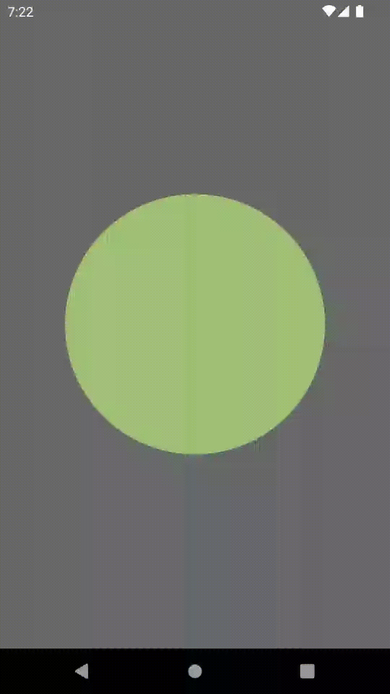

# flutter_animations

In this project u  will be able to learn simple animation methods using flutter
In flutter there is mainly two types
* [Explicit  Animations :](#explicit-animations) Explicit Animation (self designed Animations )
* [Implicit Animations :](#implicit-animations) Implicit Animation (flutter in build Animation Styles)

## Explicit Animations

### Example_1_Animations
transform rotation through through pivot x,y,z axis

### Example 2 custom clipper example and looop rotation
draw semi-circle with drawarc with container 

### Example 3 3D Box design example
draw 3D box with  stack translate and rotate using vector 3

### Example 4 Hero Animation example
designed a hero animation that wil decide what will happen to hero widget if pressed

### Example 7 custom painter

Created a paiter that paints the  polygons that will paint according to no of sides and animates for each sides and rotaion with radius size

### Example 8 Draggable Drawer Animation

Created a gesture detector to drag the drawer and detect if drag less than 50% delta value of screen reverse animation

### Exmple 9 prompBoxAnimation

created a prompt animation with cliping and resize icon and container with slide with offset animation and scale with size animation transition 

## Implicit Animations
Flutter In Built Animations with Animated widgeets

### Example 5 Animated Container
used implicit animated container to zoomin and out

### Example 6 TweenAnimationBuilder to create ColorTween 
created a circle with clipper then used the Animatedtween to  tween the color 

### additional animations
tried to create a style simalar to image in a bouncing ball

tried to create text animation front and back according to string

