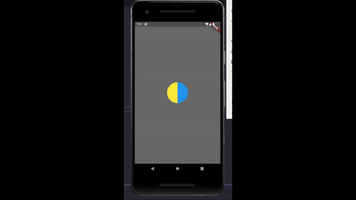

# flutter_animations

In this project u  will be able to learn simple animation methods using flutter

### Example_1_Animations
transform rotation through through pivot x,y,z axis

### Example 2 custom clipper example and looop rotation
draw semi-circle with drawarc with container 

### Example 3 3D Box design example
draw 3D box with  stack translate and rotate using vector 3

